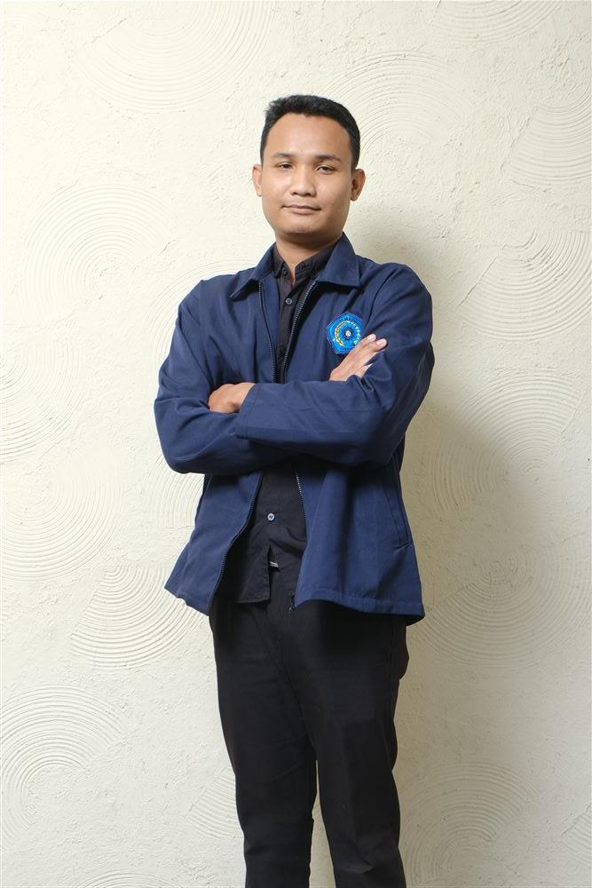

# 💼 Ahmad Hadi Lukmanul Hakim — Web Profile & Portfolio

<div align="center">

  

  ### **Junior Software Developer & IT Support Specialist**
  *S1 Teknik Informatika — Universitas Muhammadiyah Semarang (IPK 3.76)*

  [](https://ahmadhadilukman.vercel.app)
  [](https://nextjs.org/)
  [](https://www.typescriptlang.org/)
  [](https://tailwindcss.com/)
  [](https://www.framer.com/motion/)

</div>

---

## 📌 Ringkasan Profil

Selamat datang di repository web portofolio profesional **Ahmad Hadi Lukmanul Hakim**. Aplikasi web ini dibangun menggunakan **Next.js (App Router)** dan **TypeScript** dengan fokus pada estetika modern, responsif penuh (Mobile & Desktop), serta performa animasi 60 FPS yang mulus.

Web ini menampilkan rekam jejak akademis (IPK 3.76), pengalaman kerja IT Support di **RS Roemani Muhammadiyah** dan magang SIMRS di **RS PKU Muhammadiyah Gubug**, sertifikasi resmi dari **Oracle Academy**, serta showcase proyek-proyek nyata.

---

## ✨ Fitur Utama Website

* **☀️ Dual Theme Mode (Light & Dark)**:
  * **Light Mode:** Tema *Clean Ice Slate* dengan aksen **Vibrant Royal Blue** (`#2563eb`) & **Sky Blue**.
  * **Dark Mode:** Tema *Deep Charcoal Navy* (`#0d111a`) dengan aksen **Soft Sapphire Blue** & **Warm Amber**, bebas dari kesan AI cyan berlebihan.
  * **Theme Switcher:** Fitur toggle tema di Navbar yang secara otomatis mendeteksi preferensi sistem dan menyimpan di `localStorage`.
* **🎨 Visual & Motion Performa Tinggi**:
  * Efek latar belakang *Ambient Grid Lines* yang tenang di mata.
  * Micro-interactions & *scroll reveal animations* berbasis `framer-motion`.
  * Bingkai foto profil interaktif dengan badge statistik IPK & sertifikasi.
* **📱 100% Responsif**:
  * Tampilan yang dioptimalkan untuk perangkat Mobile (375px), Tablet (768px), hingga Desktop layar lebar (1440px+).
* **💬 Form Kontak & WhatsApp Direct**:
  * Fitur salin email instan dan form kirim pesan langsung terintegrasi dengan chat WhatsApp.

---

## 🚀 Proyek-Proyek Nyata Terintegrasi (Projects Showcase)

| Proyek | Kategori | Deskripsi | Tautan |
| :--- | :--- | :--- | :--- |
| **Idiomatch Web** | Web & Education | Kamus dan quiz idiom Bahasa Inggris interaktif untuk tugas akademis dosen UNIMUS. | [Repo](https://github.com/hadi77738/idiomatch_web) • [Live Demo](https://idiomatch.vercel.app) |
| **Absensi Smart** | Mobile Application | Aplikasi Android Flutter & Firebase presensi cerdas berbasis pengenalan wajah (*Face Recognition*) dan geolokasi GPS. | [Repo](https://github.com/hadi77738/absensi-smart) |
| **Sumber Rejeki Mebel** | Web UMKM | Web Company Profile & katalog digital produk mebel rumahan di Desa Kebonbatur, Demak. | [Repo](https://github.com/hadi77738/sumberrejekimebel) • [Live Demo](https://sumberrejekimebel.vercel.app) |
| **LSPosed GPS Setter** | Android Utility | Modul LSPosed Android untuk fake GPS dengan widget instan, switch lokasi, dan simulasi rute pergerakan otomatis. | [Repo](https://github.com/hadi77738/LSPosed-GPS-Setter) |

---

## 🛠️ Tech Stack & Dependencies

* **Framework:** [Next.js](https://nextjs.org/) (App Router, React 18)
* **Language:** [TypeScript](https://www.typescriptlang.org/)
* **Theme Management:** [next-themes](https://github.com/pacocoursey/next-themes)
* **Styling:** [Tailwind CSS](https://tailwindcss.com/)
* **Animations:** [Framer Motion](https://www.framer.com/motion/)
* **Icons:** [Lucide React](https://lucide.dev/)
* **Deployment:** [Vercel](https://vercel.com/)

---

## 💻 Panduan Menjalankan di Lokal (Local Setup)

1. **Clone repository ini:**
   ```bash
   git clone https://github.com/hadi77738/ahmadhadilukman.git
   cd ahmadhadilukman
   ```

2. **Install dependensi:**
   ```bash
   npm install
   ```

3. **Jalankan Development Server:**
   ```bash
   npm run dev
   ```

4. **Buka di browser:**
   Akses `http://localhost:3000`

---

## 📬 Kontak & Informasi

* **Email:** [ahmad.hadi77738@gmail.com](mailto:ahmad.hadi77738@gmail.com)
* **WhatsApp:** [+62 858 7837 1521](https://wa.me/6285878371521)
* **LinkedIn:** [ahmadhadi77738](https://linkedin.com/in/ahmadhadi77738)
* **GitHub:** [hadi77738](https://github.com/hadi77738)
* **Lokasi:** Kab. Grobogan, Jawa Tengah

---

<div align="center">
  <sub>Built with ❤️ by Ahmad Hadi Lukmanul Hakim</sub>
</div>
